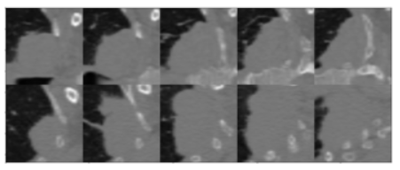
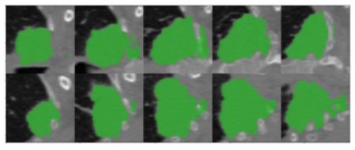
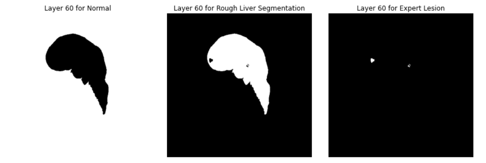

# Machine Learning Portfolio
> Portfolio of machine learning projects completed for academic & self-learning purposes.

  

## Academics

*to be done*

## Personal

#### Detecting breast cancer metastases 

The goal of the challenge is to detect **lymph node metastases** in histological images of patients diagnosed with breast cancer. Each patient is described by **1,000** small images (tiles) extracted from one whole-slide image. 

<figure align='center'>
   
   <figcaption><i>Example of two tiles (non-tumoral on the left, tumoral on the right)</i></figcaption>
</figure>

Additionally, we have **11** patients for which each tile was annotated by a pathologist (total of **10,024** annotated tiles). Based on these annotated patients, I built a model that predicts the **probability of metastases in the tile**. Next, I computed the probabilities for every tile of the non-annotated patients. Based on these predictions, I built a model that predicts whether or not **a patient has any metastases** in its slide.

------

#### Predicting lung cancer survival time 

The goal of the challenge is to predict **survival time** of patients diagnosed with lung cancer, based on 3-dimensional radiology images (CT scans). Clinical data of patients and radiomics (quantitative features extracted from the scan) are also provided.

    <figure style='display:inline-block;vertical-align:top;'>
        
        <figcaption><i>CT Scan</i></figcaption>
    </figure>
    <figure style='display:inline-block;vertical-align:top;'>
        
        <figcaption><i>Mask of tumor (green part)</i></figcaption>
    </figure>

Based on the imaging modality (scan & mask), I re-computed radiomics features using [PyRadiomics](https://pyradiomics.readthedocs.io/en/latest/) (the radiomics data provided was only a subset of what could be computed using that library). After a feature selection process using ***VIF***, I built a **Cox Proportional Hazard** model to predict the survival time of the patients.

------

    <h4 style="display: inline;">Segmentation of liver tumor &nbsp;</h4>
    
    <i>ongoing</i>

The goal of this [challenge](https://competitions.codalab.org/competitions/17094) is to segment liver lesions in contrast­-enhanced abdominal CT scans. Liver segmentation and tumor burden estimation are also evaluated. The data and segmentations are provided by various clinical sites around the world.

<figure align='center'>
   
   <figcaption><i>Example of a CT scan</i></figcaption>
</figure>

The first step of the process was to create a function that generates sub-volumes from our images. I also made sure that the sub-volumes extracted were relevant (i.e. at least 5% of something other than the background class). I am now building a U-Net architecture to complete the task of segmentation.
