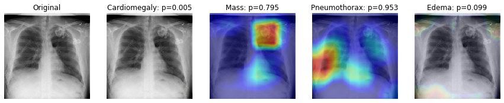
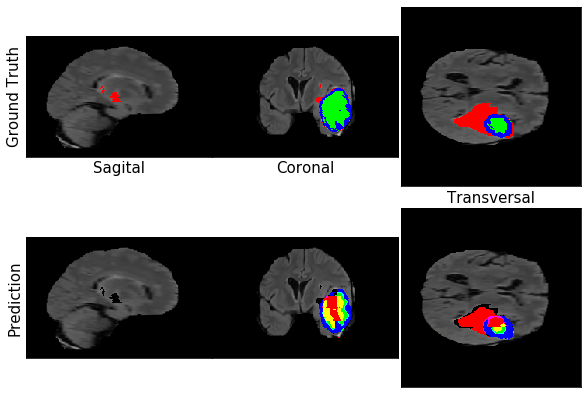

# Machine Learning Portfolio
> Portfolio of machine learning projects completed for academic & self-learning purposes.

  

*It's better to look at it on this [link](https://ilyessagg.github.io/) instead of on github.*

## Academics

*A project with 📜 means I had some external help (project as part of a course or help from a teacher).*

------

### Predicting hotel review ratings based on text review

The goal of the project is to be able to predict the rating of a review based on text review.

|     | Reviews Text | Reviews Rating |
| :-: | :----------: | :------------: |
| 1 | This hotel was nice and quiet. Did not know, ... | 3 |
| 2 | Not cheap but excellent location. Price is ... | 5 |
| 3 | Parking was horrible, somebody ran into my ... | 3 |
| . . . | . . . | . . . |

After preprocessing the text (*tokenization, stopwords, lemmatization, etc.*), I used *SentimentAnalyzer* in the nltk library to rate the sentiment of a review  (~ 1 means positive, ~ -1 means negative). From that grade I build a classifier that would predict the rating of the review.

Another method I implemented was to use [fasttext](https://fasttext.cc/docs/en/supervised-tutorial.html), a library for learning of word embeddings and text classification created by Facebook's AI Research lab.

------

### *Grand Débat* synthesis 

The goal of this project is to generate a synthesis of the data created by French citizens to answer some political open questions. 

    
    
<i>TSNE Visualization of corpus</i>

My approach focused on the environmental questions. I also used N_Grams and LDA to pick up the subjects that came up most often in the answers. The results were issues like overconsumption, greenhouse gas emissions, extinction of species, fossil/nuclear energy, etc. Finally, I looked at whether those subjects emerged in the summary of Emmanuel Macron's appearance in the ***Grand Débat*** emission.

------

### Scrapping & Classification of 2 dog breeds 📜

This project was an introduction to the use of CNNs. Using *Selenium*, we scrapped images of both akita inu and giant schnauzer.

    
    
<i>Example of images (giant schnauzer on the left, akita inu on the right)</i>

We built a basic CNN structure for this classification task. We then built another network using a pretrained model (VGG19 with Imagenet) and compared the results. Finally, we looked at the feature maps to gain a better understanding of the features detected by our model.

------

### Activity prediction based on physiological and motion data 

**[PPG-DaLiA](https://archive.ics.uci.edu/ml/datasets/PPG-DaLiA)** is a multimodal dataset featuring physiological and motion data, recorded from both a wrist- and a chest-worn device, of 15 subjects while performing a wide range of activities under close to real-life conditions. This dataset is designed for PPG-based heart rate estimation but our instructor challenged us to predict the activity of the subjects.

    
    
<i>Plot of the heartrate during the different activities.</i>

The purpose of this project was to deal with diverse sources of data and determine how to make use of them for our task. For example, each sensor had a different frequency so understanding and standardizing the different attributes was the essential part of the project. 

Since the dataset provides the data for only 15 subjects, I aimed my study at looking how the model developed would perform on unseen data.

## MOOCs

### Chest XRay Classifier 📜

The goal of this project was to build a chest X-ray classifier based on the [ChestX-ray8 dataset](https://arxiv.org/abs/1705.02315). Each of the X-ray images is associated with 14 different pathological conditions.

We used transfer learning to retrain a DenseNet model, built a weighted loss function to address class imbalance, and visualized our model's activity using [Grad-CAM](https://arxiv.org/abs/1610.02391).

    
    
<i>Example of the computed activity of an Xray image.</i>

------

### Brain tumor segmentation 📜 

The goal of this project was to build a neural network to automatically segment tumor regions in brain, using MRI scans.

    
    
<i>Visualization of an MRI image.</i>

We generated sub-volumes of our data and built a 3D U-net network. We looked at different metrics to evaluate our model (soft dice loss, dice coefficient, sensitivity, specificity) and applied those on entire scans.

    
    
<i>Comparison between prediction and ground truth.</i>

## Personal

### Detecting breast cancer metastases 

The goal of the challenge is to detect **lymph node metastases** in histological images of patients diagnosed with breast cancer. Each patient is described by **1,000** small images (tiles) extracted from one whole-slide image. 

    
    
<i>Example of two tiles (non-tumoral on the left, tumoral on the right)</i>

Additionally, we have **11** patients for which each tile was annotated by a pathologist (total of **10,024** annotated tiles). Based on these annotated patients, I built a model that predicts the **probability of metastases in the tile**. Next, I computed the probabilities for every tile of the non-annotated patients. Based on these predictions, I built a model that predicts whether or not **a patient has any metastases** in its slide.

------

### Predicting lung cancer survival time 

The goal of the challenge is to predict **survival time** of patients diagnosed with lung cancer, based on 3-dimensional radiology images (CT scans). Clinical data of patients and radiomics (quantitative features extracted from the scan) are also provided.

    

        
        
<i>CT Scan</i>

    

    

        
        
<i>Mask of tumor (green part)</i>

    

Based on the imaging modality (scan & mask), I re-computed radiomics features using [PyRadiomics](https://pyradiomics.readthedocs.io/en/latest/) (the radiomics data provided was only a subset of what could be computed using that library). After a feature selection process using ***VIF***, I built a **Cox Proportional Hazard** model to predict the survival time of the patients.

------

    <h4 style="display: inline;">Segmentation of liver tumor</h4>
    
    <i>ongoing</i>

The goal of this [challenge](https://competitions.codalab.org/competitions/17094) is to segment liver lesions in contrast­-enhanced abdominal CT scans. Liver segmentation and tumor burden estimation are also evaluated. The data and segmentations are provided by various clinical sites around the world.

    
    
<i>Example of a CT scan</i>

The first step of the process was to create a function that generates sub-volumes from our images. I also made sure that the sub-volumes extracted were relevant (i.e. at least 5% of something other than the background class). I am now building a U-Net architecture to complete the task of segmentation.
